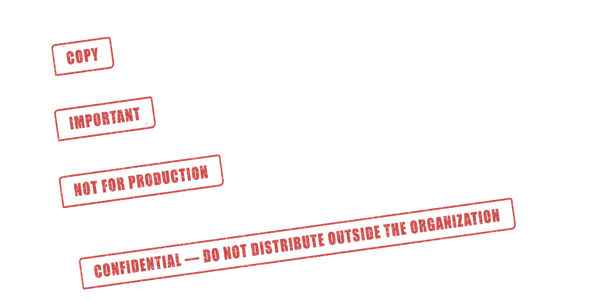
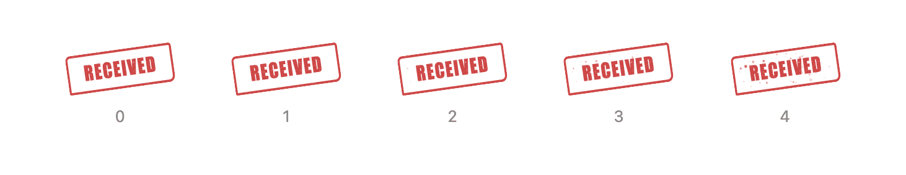

# react-rubber-stamp 🖃

[](https://www.npmjs.com/package/react-rubber-stamp) [](https://www.typescriptlang.org/)
[](https://badge.fury.io/js/react-rubber-stamp)
[](https://www.npmjs.com/package/react-rubber-stamp)
[](https://packagephobia.com/result?p=react-rubber-stamp)
[](https://piecioshka.mit-license.org)
[](https://github.com/piecioshka/react-rubber-stamp/actions/workflows/testing.yml)

> Worn-out rubber stamp component for React — any text length, no CSS import, no image assets.


Most "stamp" components are a rectangle with a border. This one masks the ink with generated fractal noise — blotches where the pad ran dry, scratches carved by the worn edges of the rubber, and flecks of stray ink around the text — so it looks pressed rather than drawn. Everything is generated rather than loaded from a bitmap, and it tiles at a size tied to the type, so `Beta` and `Confidential — do not distribute outside the organization` carry the same grain at any font size.

## Install 📦

```bash
npm install react-rubber-stamp
```

React 17 or newer is a peer dependency.

## Usage 🔨

```tsx
import { Stamp } from "react-rubber-stamp";

<Stamp>Beta</Stamp>;
```

That is the whole setup. There is no stylesheet to import — the component injects its CSS into `<head>` on first render.

```tsx
<Stamp color="#1e6f3f" rotate={6}>Approved</Stamp>
<Stamp distress="heavy" speckle={4}>Confidential — internal use only</Stamp>
<Stamp distress="none">Draft</Stamp>
```

## Any text length ↔️

The grain is tiled rather than stretched, so a single word and a full sentence wear the same way.



## Distress 🧽

How much ink the pad has lost.


```tsx
<Stamp distress="none">Approved</Stamp>
<Stamp distress="heavy">Approved</Stamp>
```

## Speckle 💦

Stray flecks of ink around the text, on a five-step scale. They are clipped to the frame, so a fleck never escapes past it. Defaults to one step below the matching `distress` level.



```tsx
<Stamp speckle={0}>Received</Stamp>
<Stamp speckle={4}>Received</Stamp>
```

## Colors and rotation 🎨


```tsx
<Stamp color="#1e6f3f" rotate={6}>Approved</Stamp>
<Stamp color="#2b4f9c" rotate={-14}>Received</Stamp>
```

## Scales with font-size 📐

Borders, corners, padding and grain are all sized in `em`, so one `font-size` scales the whole stamp and keeps its proportions.


```tsx
<Stamp style={{ fontSize: "3rem" }}>Certified</Stamp>
```

## Props 📋

| Prop        | Type                                       | Default            | Description                                                          |
| ----------- | ------------------------------------------ | ------------------ | -------------------------------------------------------------------- |
| `children`  | `ReactNode`                                | —                  | Text to stamp. Any length.                                           |
| `color`     | `string`                                   | `#c62828`          | Ink color. Any CSS color.                                            |
| `distress`  | `"none" \| "light" \| "medium" \| "heavy"` | `"medium"`         | How worn out the ink looks.                                          |
| `speckle`   | `0 \| 1 \| 2 \| 3 \| 4`                    | follows `distress` | Stray flecks of ink around the text. `0` is a clean press.           |
| `rotate`    | `number`                                   | `-8`               | Rotation in degrees.                                                 |
| `seed`      | `string \| number`                         | the text           | Varies the noise pattern. Same seed always renders the same pattern. |
| `opacity`   | `number`                                   | `0.85`             | Ink coverage, `0`–`1`.                                               |
| `blendMode` | `MixBlendMode`                             | `multiply`         | How the ink blends with what is underneath.                          |
| `wrap`      | `boolean`                                  | `false`            | Let long text break across lines.                                    |

Any other prop (`className`, `id`, `aria-*`, `onClick`, …) is forwarded to the underlying `<span>`, and `ref` is forwarded too.

## Theming 🎨

Every visual detail is a custom property, so you can restyle the stamp from your own CSS without touching the props:

```css
.my-stamp {
  --rrs-font-family: "Special Elite", cursive;
  --rrs-border-width: 0.2em;
  --rrs-letter-spacing: 0.2em;
  --rrs-radius: 0.4em 0.1em 0.35em 0.15em;
}
```

```tsx
<Stamp className="my-stamp">Beta</Stamp>
```

Available properties: `--rrs-color`, `--rrs-border-width`, `--rrs-border-style`, `--rrs-radius`, `--rrs-padding`, `--rrs-font-size`, `--rrs-font-family`, `--rrs-font-weight`, `--rrs-font-stretch`, `--rrs-letter-spacing`, `--rrs-tile-size`, `--rrs-opacity`, `--rrs-blend-mode`, `--rrs-rotate`.

> [!TIP]
> Sizes are in `em` on purpose. Overriding one with a pixel value pins it while everything else keeps scaling, which is usually not what you want.

## Notes 📒

> [!NOTE]
> The stamp is decorative by default. If it carries meaning your users need, keep the text readable and skip `aria-hidden`; if it only repeats something already on the page, pass `aria-hidden="true"`.

> [!NOTE]
> `seed` defaults to the stamped text, so server and client renders agree. Two stamps with the same text look identical on purpose — pass an explicit `seed` when you want them to differ.

## Demo 📺

```bash
npm run demo
```

Builds the package and opens a page with every prop side by side, each example showing the JSX that produced it.

## License

[The MIT License](https://piecioshka.mit-license.org) @ 2026
